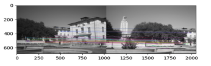
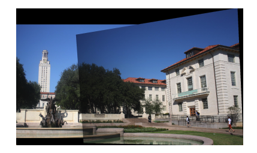

# Image Mosaicking and Homography Estimation

**Steps**:
- Calculate the homography matrix using the correspondences: `H = computehomography(ptA, ptB)`
- Verify the accuracy of the homography by mapping the points from **imgA** to **imgB**: `verifyhomographymatrix(imgA, imgB, H)`

The output of this function overlays the transformed points onto the images, allowing us to visually check if the transformation aligns well with the original points.

#### 1.3 Warping Between Image Planes
With the homography matrix in hand, the next step is to warp one image into the plane of the other. This is achieved using the `WarpImage(imgA, H)` function, which takes the homography matrix **H** and applies the transformation to warp **imgA**.

**Steps**:
- Apply the homography matrix **H** to the source image **imgA**.
- For each pixel in **imgA**, map its coordinates to the corresponding coordinates in the destination image using bilinear interpolation to handle subpixel accuracy.
  
The warping process needs to account for the color channels (RGB) individually. The image is warped in each channel separately and then the channels are stacked to create the final output image.

#### 1.4 Creating the Output Mosaic
After warping the source image into the destination image's coordinate system, the next step is to combine both images into a single mosaic. This involves blending the two images where the warped source image overlaps with the destination image.

**Steps**:
- Create an empty canvas large enough to hold both images.
- Place the warped source image onto the canvas, aligning it with the destination image.
- Perform image blending to minimize seams or artifacts where the two images meet.

The output should be a seamless mosaic where the two images appear as if they were captured from a single viewpoint.

#### 1.5 Debugging the System
At this point, you should apply the image mosaicking system to the provided image pair and debug any issues related to the stitching, alignment, or blending. It's important to carefully check the image alignment after applying the homography transformation.

#### 1.6 Show Additional Example of a Mosaic
To further test the robustness of your image stitching system, you can apply it to a new pair of images and observe the results.

#### 1.7 Show Another Example of a Mosaic
Continuing with testing, create another mosaic to see how well the algorithm performs on different sets of images.

- **Figure 6**: Second additional example of a mosaic:

#### 1.8 Warp One Image into a "Frame" Region in the Second Image
In this section, we focus on warping one image into a specific "frame" region of the second image. This demonstrates the flexibility of the homography transformation and how it can be used to position one image inside a particular region of another.

- **Figure 7**: Warped image inside the frame of the second image:

---

### 2. Automatic Image Mosaics

#### 2.1 Use VLFeat for Interest Points and Descriptors
In this section, we switch from manual correspondences to an automatic method using the VLFeat library. This library allows us to automatically detect interest points and extract descriptors for image matching. The function `gettingcorrespondencessift(image1, image2)` detects keypoints and matches descriptors between two images.

**Steps**:
- Use VLFeat to detect keypoints and compute descriptors for both images.
- Match the descriptors between the two images.
  
This automatic method is much more efficient than manually selecting correspondences and can work well with large image datasets.

- **Figure 8**: Example of automatic keypoint matching:

#### 2.2 Implementing RANSAC for Robust Homography Estimation
RANSAC (Random Sample Consensus) is used to estimate the homography matrix in the presence of noisy or outlier correspondences. It is a robust method that minimizes the effect of outliers by iteratively selecting random subsets of the correspondences and fitting a homography to those points.

**Steps**:
- Use RANSAC to estimate the homography matrix and filter out bad correspondences.
- Compare the result with the non-RANSAC implementation to see how it improves the homography estimation.

- **Figure 9**: Homography without RANSAC (Non-RANSAC):

- **Figure 10**: Homography with RANSAC (Robust):

---

## Conclusion
This assignment demonstrated the fundamental concepts behind image mosaicking, including manual and automatic methods for correspondence selection, homography computation, and image warping. It also provided an introduction to advanced techniques like RANSAC for robust homography estimation and the use of VLFeat for automatic feature detection and matching.

By completing this project, you should now have a deeper understanding of image transformation, stitching, and how computer vision algorithms can be applied to real-world problems such as panorama creation.

---

## References
- Szeliski, R. (2010). *Computer Vision: Algorithms and Applications*. Springer.
- VLFeat library: [http://www.vlfeat.org/](http://www.vlfeat.org/)
